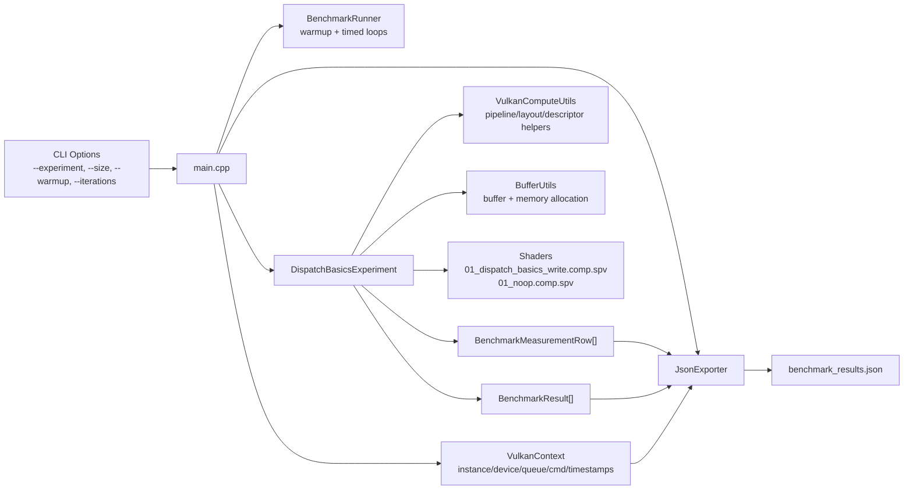
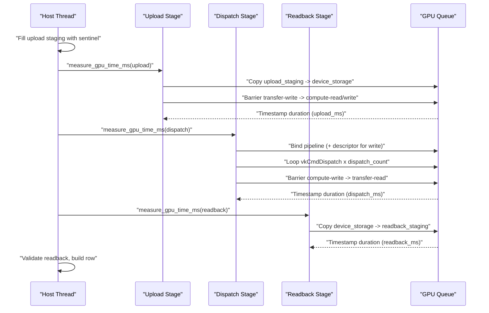
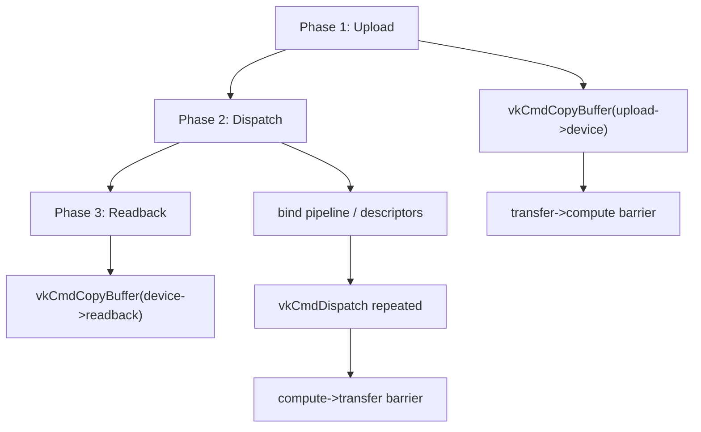
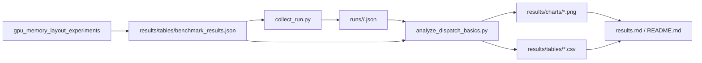

# Experiment 01 Architecture

## 1. Purpose
Experiment 01 establishes a reliable Vulkan compute baseline with:
- explicit staging path: `upload -> dispatch -> readback`
- deterministic correctness checks
- GPU timestamp-based dispatch timing
- reproducible sweep outputs for later experiments

This document explains the runtime architecture, key concepts, and detailed flow.

## 2. Runtime Components

## 3. GPU Resource Architecture
The experiment uses one persistent buffer set for the write path:
- device storage buffer: `DEVICE_LOCAL`, `STORAGE | TRANSFER_SRC | TRANSFER_DST`
- upload staging buffer: `HOST_VISIBLE | HOST_COHERENT`, `TRANSFER_SRC`
- readback staging buffer: `HOST_VISIBLE | HOST_COHERENT`, `TRANSFER_DST`

Descriptor/pipeline model:
- `contiguous_write` variant: descriptor-backed storage buffer pipeline
- `noop` variant: pipeline with no storage descriptor usage

## 4. Sweep Model
From code constants and runtime constraints:
- local size `kLocalSizeX = 64`
- problem size powers: `2^10 .. 2^24`, clamped by:
  - scratch bytes (`--size`)
  - `maxComputeWorkGroupCount[0]`
- dispatch sweep:
  - `{1, 4, 16, 64, 128, 256, 512, 1024}`
- variants:
  - `contiguous_write`
  - `noop`

With `--size 4M`, effective max is `2^20` floats.

## 5. Per-Iteration Execution Path
Each measured iteration follows strict staging order:

## 6. Command Buffer Phase Contract

Key guarantee:
- synchronization is explicit and local to the stage being measured.

## 7. Timing and Metrics Semantics
Per measured point:
- `gpu_ms`: dispatch stage GPU timestamp duration only
- `end_to_end_ms`: host wall-clock around `upload + dispatch + readback`
- `throughput`: `(problem_size * dispatch_count) / (gpu_ms / 1000)`
- `gbps`: `(problem_size * dispatch_count * sizeof(float)) / (gpu_ms * 1e6)`

Warmup iterations:
- executed per `(variant, problem_size, dispatch_count)`
- timings ignored, used to stabilize pipeline/cache behavior

Timed iterations:
- row emitted for each iteration

## 8. Correctness Model
`contiguous_write`:
- input sentinel `-1.0f`
- expected output: `value[index] == float(index)`

`noop`:
- input sentinel `-2.0f`
- expected output unchanged sentinel

Row correctness:
- `correctness_pass = finite(upload_ms, dispatch_ms, readback_ms) && data_match`

Run-level gate:
- if any measured row fails, experiment exits with failure in `main.cpp`

## 9. Result and Analysis Pipeline

Multi-device support:
- one run JSON per device/session under `runs/`
- analyzer merges runs and emits device-aware tables/charts

## 10. Why This Architecture Matters
This design isolates important concerns:
- correctness is validated before claiming performance
- dispatch timing is separated from full pipeline timing
- synchronization and data movement are explicit
- outputs are structured for reproducible, cross-device comparison

As a result, Experiment 01 serves as a trustworthy baseline for subsequent layout and kernel experiments.
