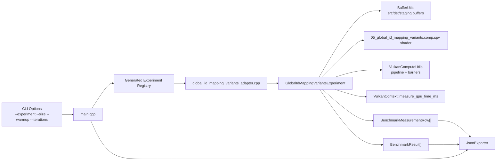
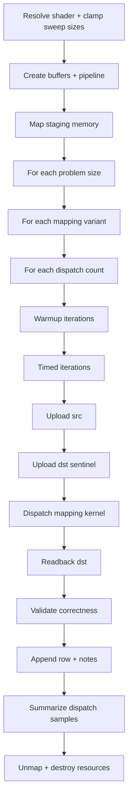
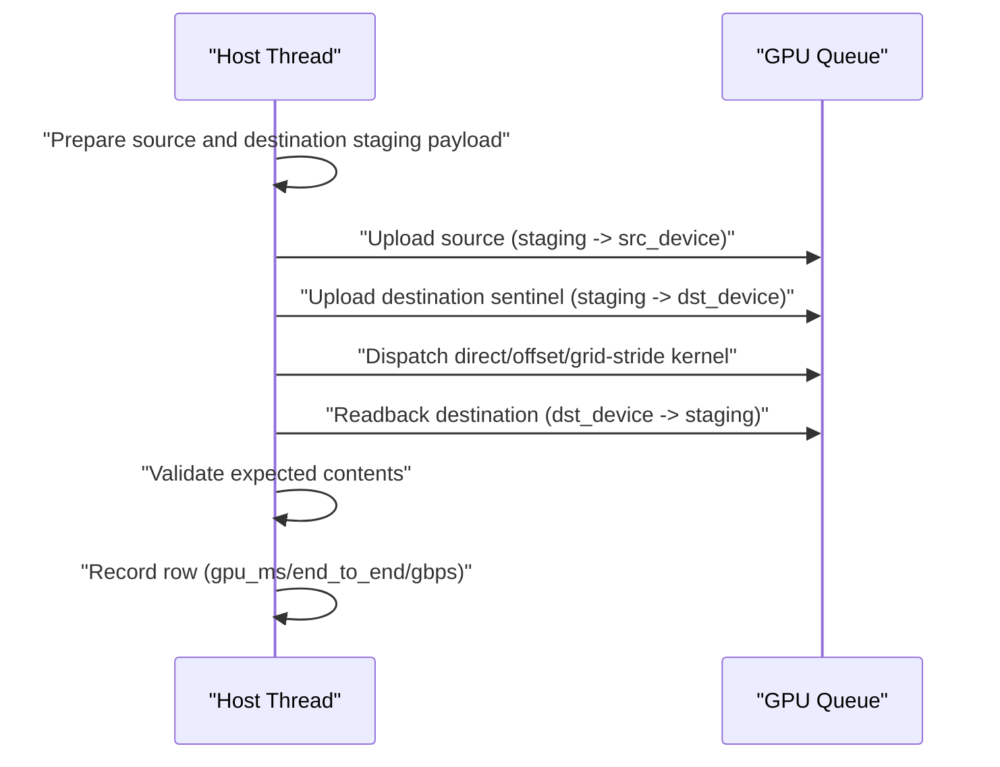
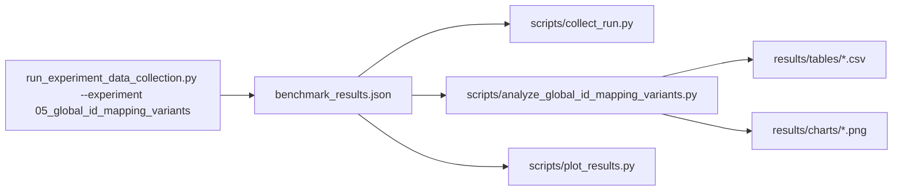

# Experiment 05 Architecture

## 1. Purpose
Experiment 05 compares three global index mapping strategies in a matched read+write compute kernel:
- direct (`i -> i`)
- fixed offset (`i -> (i + offset) mod N`)
- grid-stride loop (`i, i + stride, ...`)

All variants apply the same deterministic transform to isolate mapping overhead and scalability behavior.

## 2. Runtime Component Architecture

## 3. Resource Ownership Model
Shared buffers:
- `src_device` (device-local storage + transfer)
- `dst_device` (device-local storage + transfer)
- `staging` (host-visible transfer src/dst)

Pipeline resources:
- shader module
- descriptor set layout
- descriptor pool + descriptor set
- pipeline layout
- compute pipeline

Ownership rule:
- experiment function creates and destroys all resources
- teardown is reverse-order
- handles are reset to `VK_NULL_HANDLE`

## 4. Execution Flow

## 5. Per-Iteration Command Sequence

## 6. Data and Analysis Pipeline

