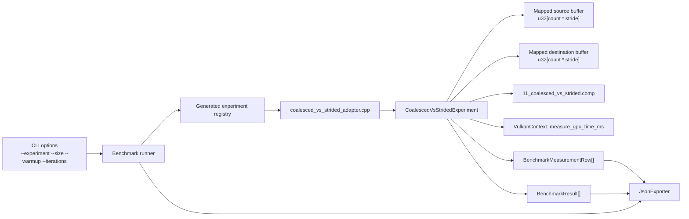
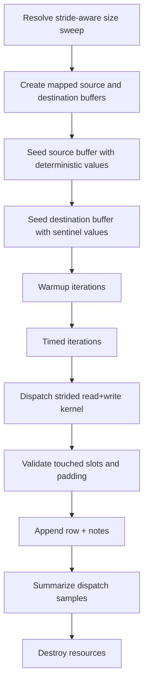
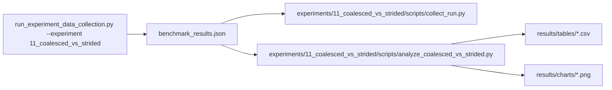

# Experiment 11 Coalesced vs Strided Access: Runtime Architecture

## 1. Purpose
Experiment 11 measures how access stride changes GPU memory behavior in a simple read+write kernel:
- `stride = 1` is the coalesced baseline
- larger strides are the strided cases
- arithmetic, element type, and logical work stay constant

The benchmark is intentionally narrow:
- no shared memory
- no atomics
- no subgroup operations
- no extra control flow beyond bounds checks

## 2. Runtime Contract
The initial contract is a single parameterized compute shader with one stride value supplied at runtime.

Logical model:
- element type: `u32`
- logical element count: `count`
- stride in elements: `stride`
- physical buffer span in elements: `count * stride`
- physical buffer span in bytes: `count * stride * sizeof(uint32_t)`

Buffer model:
- `src_buffer`: mapped storage buffer, seeded with a deterministic `u32` pattern
- `dst_buffer`: mapped storage buffer, seeded with a deterministic sentinel pattern
- both buffers are sized to the same physical span
- no staging buffer is required for the first draft
- `max_buffer_bytes` is treated as a per-buffer cap, matching the existing experiment contract
- total transient allocation is approximately `2 * count * stride * sizeof(uint32_t)`

Per-invocation work:
- `logical_index = gl_GlobalInvocationID.x`
- exit when `logical_index >= count`
- `physical_index = logical_index * stride`
- `value = src_buffer[physical_index]`
- `dst_buffer[physical_index] = value + 1u`

Validation model:
- touched destination slots must equal `seed_value + 1u`
- untouched destination slots must remain at the sentinel pattern
- source buffer remains unchanged after dispatch
- integer validation is exact; no tolerance is required

Measurement model:
- workgroup size: `256`
- dispatch count: `1` per timed sample
- `problem_size` in result rows is the logical element count, not the padded physical span
- `variant` should encode the stride, for example `stride_1`, `stride_2`, `stride_4`
- `gbps` should be computed from logical bytes moved, not from padded buffer size
- logical bytes moved per element: `2 * sizeof(uint32_t)` for one read and one write

Stride-aware capacity rule:
- a candidate point is valid only when `count * stride * sizeof(uint32_t) <= max_buffer_bytes`
- the host should skip or clamp points that would exceed the configured scratch budget
- this keeps the largest stride from overrunning the allocation budget

## 3. Runtime Component Architecture


## 4. Resource Ownership Model
Pipeline resources:
- shader module
- descriptor set layout
- descriptor pool
- descriptor set
- pipeline layout
- compute pipeline

Buffer resources:
- one mapped source storage buffer
- one mapped destination storage buffer

Ownership rule:
- the experiment function creates and destroys all resources
- teardown is reverse-order
- Vulkan handles are reset to `VK_NULL_HANDLE`

## 5. Shader Layout
The shader layout should remain single-file and single-entry-point.

Recommended GLSL layout:
```glsl
#version 450

layout(local_size_x = 256, local_size_y = 1, local_size_z = 1) in;

layout(set = 0, binding = 0, std430) readonly buffer SourceBuffer {
    uint values[];
} src_buffer;

layout(set = 0, binding = 1, std430) writeonly buffer DestinationBuffer {
    uint values[];
} dst_buffer;

layout(push_constant) uniform PushConstants {
    uint count;
    uint stride;
} pc;

void main() {
    uint logical_index = gl_GlobalInvocationID.x;
    if (logical_index >= pc.count) {
        return;
    }

    uint physical_index = logical_index * pc.stride;
    uint value = src_buffer.values[physical_index];
    dst_buffer.values[physical_index] = value + 1u;
}
```

Shader layout rules:
- keep `stride` as the only access-pattern input
- keep the arithmetic trivial so the memory access is the primary variable
- keep the destination write in the same physical stride pattern as the source read
- use the `stride = 1` case as the coalesced baseline in analysis

## 6. Execution Flow


## 7. Measurement Contract
- primary timing: GPU dispatch ms via timestamp queries
- supporting timing: end-to-end host iteration time
- row fields:
  - `experiment_id`
  - `variant`
  - `problem_size`
  - `dispatch_count`
  - `iteration`
  - `gpu_ms`
  - `end_to_end_ms`
  - `throughput`
  - `gbps`
  - `correctness_pass`
  - `notes`

`notes` should include:
- `stride`
- `logical_elements`
- `physical_elements`
- `physical_span_bytes`
- `bytes_per_logical_element`
- `validation_mode`
- `skip_reason` when a candidate point is dropped by the stride-aware capacity check

## 8. Data and Analysis Pipeline

